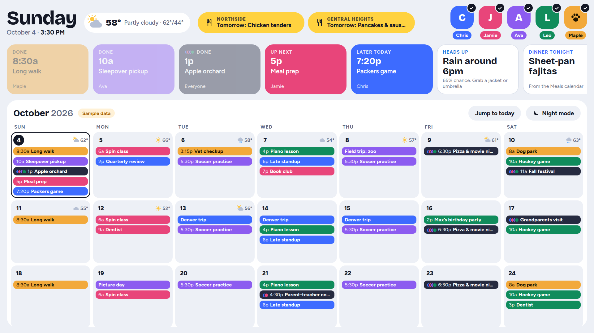
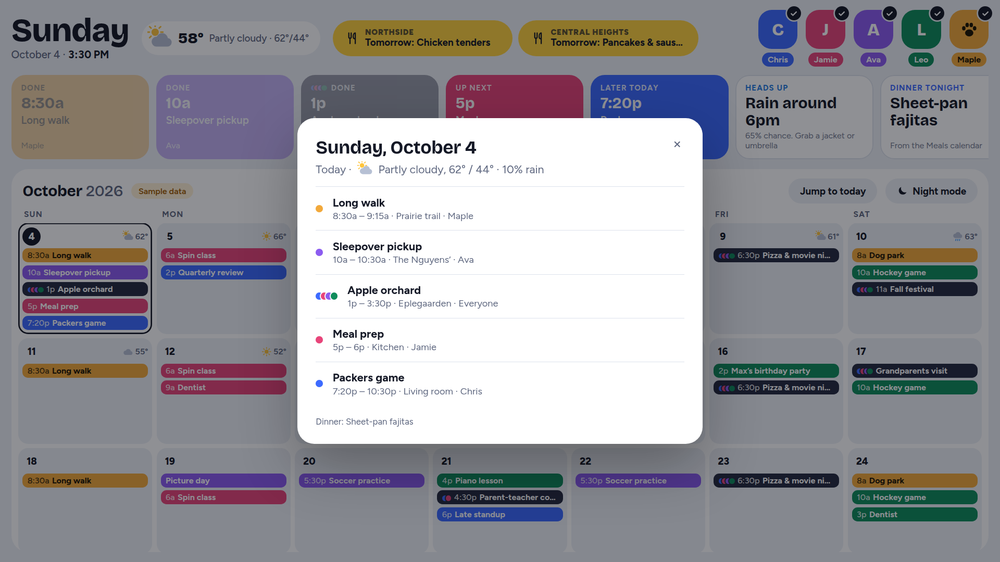
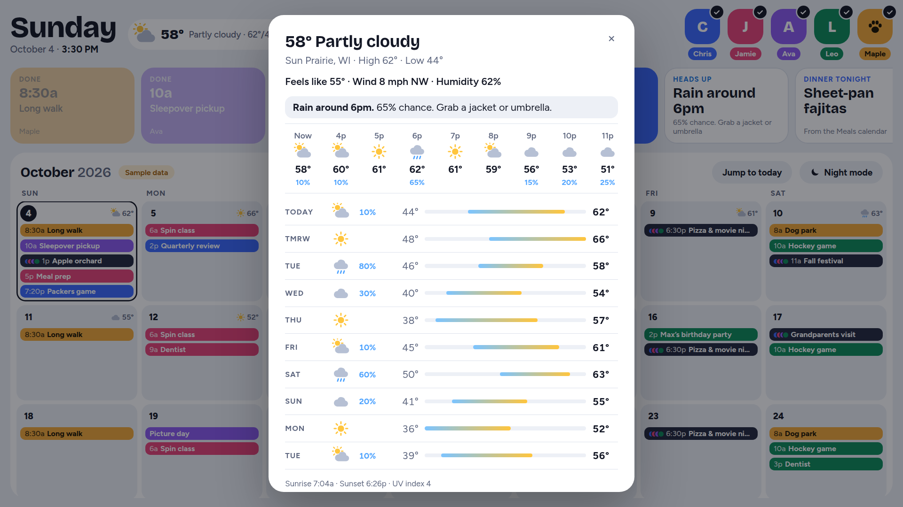
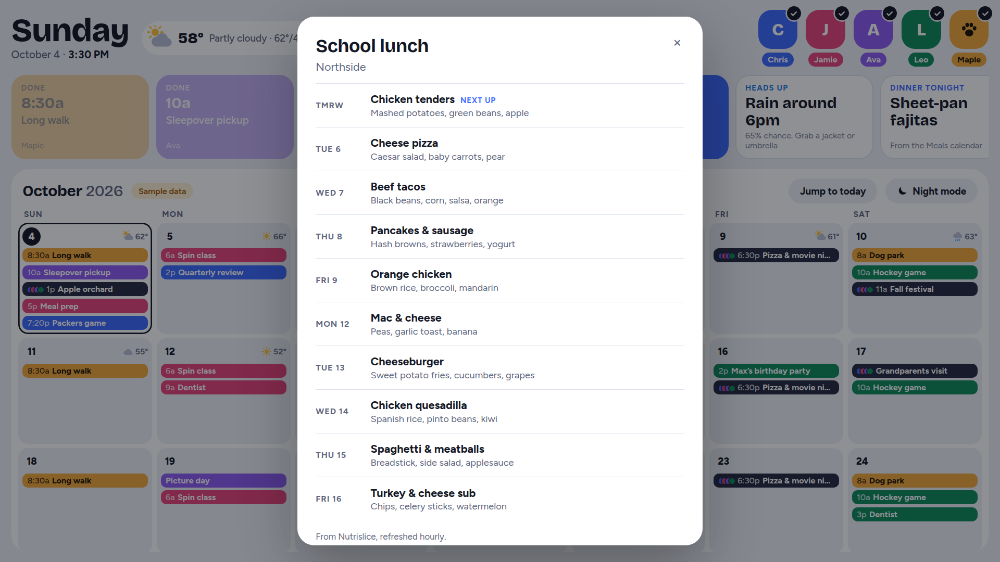
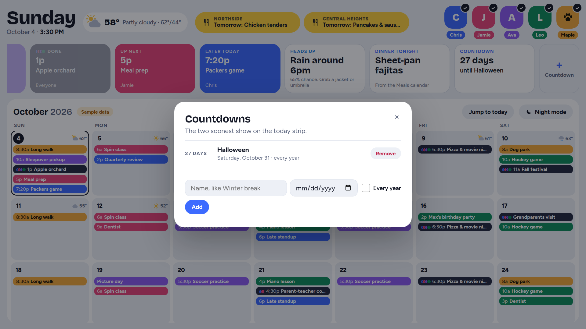
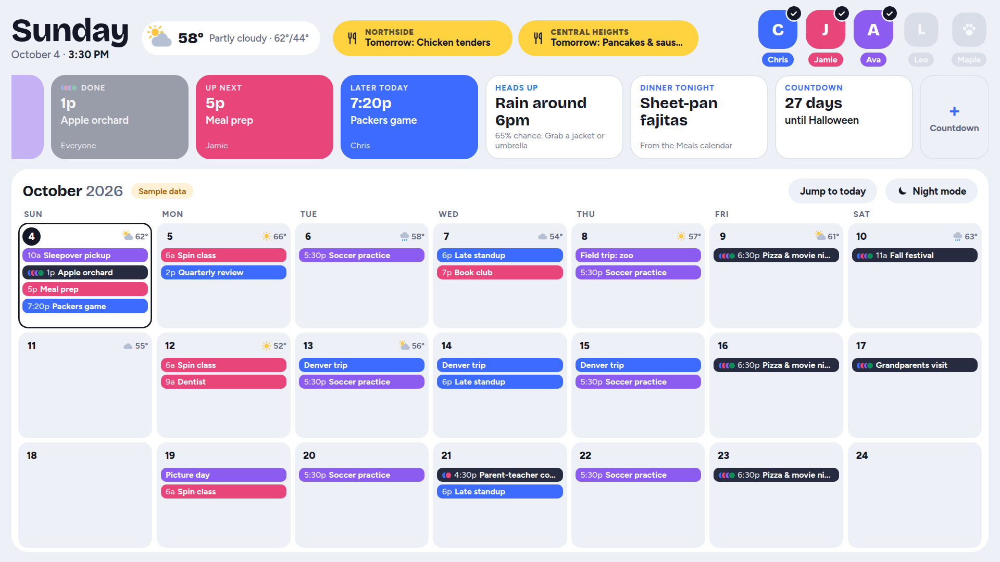
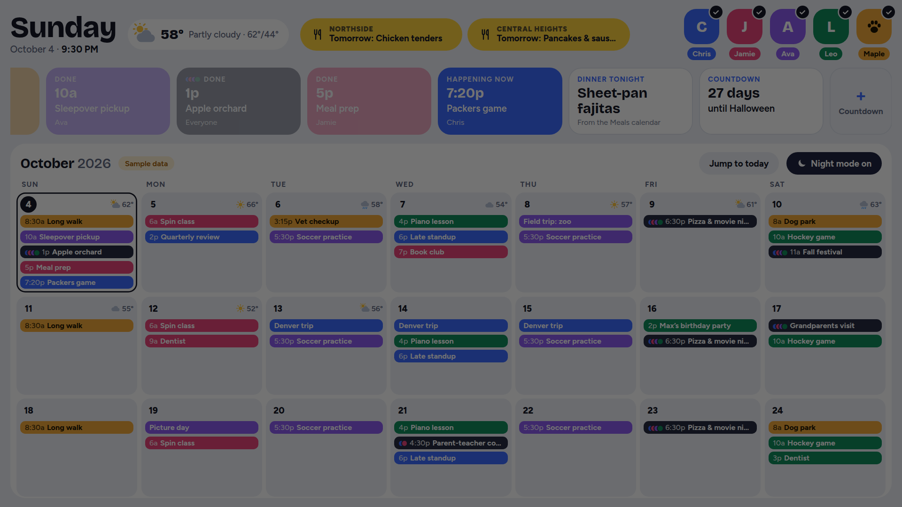
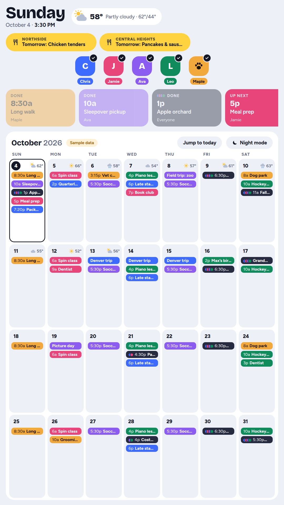

# Family Calendar

A wall calendar for a touchscreen. A small Node server runs on a computer at home, and a Raspberry Pi in kiosk mode just opens its address full screen.

Each person's Google Calendar shows in their own color. There's a photo button to show or hide each person, plus weather, school lunch, countdowns and a night mode, all in one screen that's easy to read from across the kitchen.



## Contents

- [Features](#features)
- [Screenshots](#screenshots)
- [What you need](#what-you-need)
- [Quick start (try it with sample data)](#quick-start-try-it-with-sample-data)
- [Setup guide](#setup-guide)
- [Settings reference](#settings-reference)
- [Running it all the time](#running-it-all-the-time)
- [Updating](#updating)
- [Troubleshooting](#troubleshooting)
- [How it works](#how-it-works)
- [Security](#security)
- [Development](#development)

## Features

**Calendar**
- Reads each person's Google Calendar directly, with no Google sign-in or API key.
- Every person has their own color. An event on several people's calendars shows once, with each person's color.
- The grid starts on Sunday with about three weeks on screen: last week, this week and the next ones. Scroll for up to eight weeks ahead.
- This week shows every event. Other weeks show the first few and "+N more".
- Tap any day for its full list, with times, places and who's going.
- Handles repeating events, skipped and moved occurrences, all-day and multi-day events, and daylight saving time.

**People**
- Each person gets a button with their photo (or an initial, or a paw for the dog), their name in a pill of their color, and a matching color ring.
- Tap a person to hide or show their events. The screen remembers the choice.

**Today strip**
- A card for each of today's events, marked Done, Happening now, Up next or Later today.
- Weather "Heads up" cards for rain, snow or storms later today (with the hour), cold, heat, big temperature swings and high UV. After 6pm they look at tomorrow instead.
- "Dinner tonight", from an optional Meals calendar.
- The two soonest countdowns, plus a **+ Countdown** button.

**Weather**
- The current temperature and conditions at the top, and each day's forecast in the calendar.
- Tap the weather for feels-like, wind and humidity. You also get the next 12 hours, a 10-day forecast with high and low bars, sunrise, sunset and UV.
- From Open-Meteo, so no account or key is needed.

**School lunch**
- One yellow button per school, labeled with the school's name and its next lunch. It shows today's lunch until 10am, then the next school day's.
- Tap a button for that school's menu for the next two weeks.
- From Nutrislice.

**Countdowns**
- Add and remove countdowns on the screen: type a name, pick a date, and choose whether it repeats every year.

**Night mode**
- Dims at 9pm and goes nearly black at 11pm, showing only a faint clock. It comes back at 6am. All three times can be changed.
- The moon button turns night mode on right away, or off until morning.
- Tapping a dark screen lights it up for 90 seconds, and that tap doesn't open anything underneath.

**Built for a wall**
- Sized for a 15" 1080p screen in landscape, and it also works in portrait.
- After 90 seconds untouched it closes any open panel and scrolls back to this week.
- It reloads itself at 3:30am, so a browser left running for weeks stays quick.
- It keeps showing the last good data if the internet drops, with a small "offline" tag.
- It's light enough for a Raspberry Pi 3: no framework, no build step, and no fonts or scripts from other sites.

## Screenshots

All screenshots use the built-in sample family (`npm run demo`).

| | |
| --- | --- |
|  |  |
| **Day details.** Tap any day. | **Weather.** Tap the weather at the top. |
|  |  |
| **School lunch.** One button per school. | **Countdowns.** Add and remove them on the screen. |
|  |  |
| **People.** Tap a photo to hide or show that person. | **Night mode.** Dims at 9pm and goes nearly black at 11pm. |

<p align="center"><br><b>Portrait.</b> The layout adapts when the screen is turned.</p>

## What you need

- **A computer that stays on** to run the server: a home lab box, a NAS, a Mac or Linux PC, or the Pi itself. It needs [Node.js](https://nodejs.org) 22 or newer, or Docker.
- **A screen** that opens one web page full screen, such as a Raspberry Pi with Kiosk OS or Chromium in kiosk mode, or any tablet.
- **Google Calendar**, with each person's calendar in an account you can manage (see step 2).

## Quick start (try it with sample data)

```sh
git clone https://github.com/chrisneuman/familycaly.git
cd familycaly
npm install
npm start
```

Open http://localhost:8080. Until `config/family.json` exists it shows a sample family, so you can poke around first. `npm run demo` shows the sample family even after you've set up your own.

## Setup guide

### 1. Copy the settings file

```sh
cp config/family.example.json config/family.json
```

Open `config/family.json` in a text editor. The steps below fill it in, and [Settings reference](#settings-reference) lists every option.

### 2. Get each calendar's private address

For each person's calendar, the dog's too:

1. Open [Google Calendar](https://calendar.google.com) on a computer, not the phone app.
2. Click the gear, then **Settings**.
3. On the left, under "Settings for my calendars", click the person's calendar.
4. Scroll to **Integrate calendar** and copy **Secret address in iCal format**. It ends in `basic.ics`.
5. Paste it as that person's `"ical"` in `family.json`.

Use the *secret* address, not the "public address". The public one only works if the calendar is made public.

The secret address only appears for calendars the signed-in account owns, or has "Make changes and manage sharing" permission on. If a family member owns their own calendar, either copy the address while signed in as them, or have them give your account that permission.

**Treat these addresses like passwords.** Anyone who has one can read that calendar, so don't paste them in chats or commit them anywhere. If one leaks, click **Reset** next to it in Google Calendar and paste the new one.

If someone shows far fewer events than you expect, you probably copied a secondary calendar (like Holidays or Birthdays) instead of their main one; the main one is usually named after them. A person with several calendars can list them all: `"ical": ["https://…basic.ics", "https://…basic.ics"]`.

### 3. Add the family

Edit the `people` list. Each person needs:

- `id`: a short lowercase name with no spaces, like `mom`. It's also how photos are found.
- `name`: what shows on the screen.
- `color`: a hex color like `#e8457a`. The text on top switches between dark and light automatically so it stays readable.
- `ical`: the address from step 2.

Add `"dog": true` for a pet, which shows a paw when there's no photo.

### 4. Add photos (optional)

Put a square photo of each person in `config/photos/`, named after their `id`: `mom.jpg`, `dad.png`, `vali.JPG` and so on. `.jpg`, `.jpeg`, `.png` and `.webp` all work, and capital letters in the name don't matter. About 300×300 pixels is plenty.

Photos show up the next time the page loads, with no restart. To use a different file name, set `"photo": "file-name.jpg"` on that person.

### 5. Set the location and time zone

- `timezone`: your time zone, like `America/Chicago` ([list of names](https://en.wikipedia.org/wiki/List_of_tz_database_time_zones)). Events are sorted into days in this zone, so it has to be right.
- `location`: a `name` to display, plus `latitude` and `longitude` for the weather. To find them, right-click your town in Google Maps; the first line of the menu is latitude, longitude.
- `units`: `"fahrenheit"` or `"celsius"`.

### 6. Add school lunch (optional)

Open your school's menu on Nutrislice in a browser. The address tells you what to fill in:

```
https://sunprairie.nutrislice.com/menu/northside/lunch/
        └─district─┘               └─school─┘ └menuType┘
```

Add one entry per school to `lunch`:

```json
"lunch": [
  { "district": "sunprairie", "school": "northside", "schoolName": "Northside", "menuType": "lunch" }
]
```

`schoolName` is the label on the button. Leave `lunch` out to hide the lunch buttons.

### 7. Optional extras

- **Dinner:** make a Google Calendar called "Meals" and add one all-day event per night, like "Tacos". Put its secret address in `"meals": { "ical": "…" }`, and tonight's dinner shows in the today strip.
- **Shared calendars:** a calendar that belongs to several people goes in `sharedCalendars`, like `{ "name": "Family", "ical": "…", "people": ["mom", "dad", "graycen", "maisel"] }`.
- **Night mode times:** `"night": { "dim": "21:00", "dark": "23:00", "wake": "06:00" }` (24-hour times), or `"night": false` to turn the schedule off. The moon button still works when it's off.
- **Countdowns:** `countdowns` is only the starting list. After the first run you add and remove them on the screen (see below).

### 8. Start it

```sh
npm start
```

The terminal should print something like:

```
[config] 5 people, 5 calendars
[http] family calendar on http://0.0.0.0:8080
```

Open http://localhost:8080 to check it. After any change to `family.json`, stop the server with Ctrl+C and start it again.

### 9. Point the screen at it

Find the server's address on your network. On a Mac it's in System Settings › Network; on Linux, run `hostname -I`. Then set the kiosk's start page to:

```
http://<server-ip>:8080
```

On Kiosk OS this is the start URL in its settings. With plain Raspberry Pi OS, run `chromium-browser --kiosk --noerrdialogs --disable-infobars http://<server-ip>:8080` at login. If you can, give the server a fixed IP in your router so the address doesn't change.

### Using it day to day

- **Hide or show someone:** tap their photo.
- **See a day:** tap it in the calendar.
- **Weather details:** tap the weather at the top, or a "Heads up" card.
- **Lunch menu:** tap a school's yellow button.
- **Countdowns:** tap a countdown card or **+ Countdown**. Type a name, pick a date, tick "Every year" if it repeats, and tap **Add**. Use **Remove** to delete one. They're saved on the server in `data/countdowns.json`, so every screen sees the same list.
  If the Pi has no on-screen keyboard, open the same address on a phone or laptop to add them.
- **Night mode:** tap the moon to go dark now; tap the screen to light it again. Tapping the moon while night mode is on turns it off until morning.
- **Back to this week:** tap **Jump to today**, or just leave it alone for 90 seconds.

## Settings reference

All settings live in `config/family.json`.

| Setting | Required | What it does |
| --- | --- | --- |
| `timezone` | yes | Time zone used to sort events into days, e.g. `America/Chicago`. |
| `units` | no | `fahrenheit` (default) or `celsius`. |
| `location.name` | yes | Shown in the weather panel. |
| `location.latitude`, `location.longitude` | yes | Where the weather is for. |
| `people[].id` | yes | Short unique id. Also the photo file name. |
| `people[].name` | yes | Name on the screen. |
| `people[].color` | yes | Hex color for their events and pill. |
| `people[].ical` | yes | Secret iCal address, or a list of them. |
| `people[].ink` | no | Text color on top of their color, if the automatic one isn't right. |
| `people[].photo` | no | Photo file in `config/photos/`, if it isn't named after the id. |
| `people[].dog` | no | `true` shows a paw instead of an initial. |
| `sharedCalendars[]` | no | `{ name, ical, people: [ids] }` for a calendar several people share. |
| `meals.ical` | no | A calendar with one event per day, shown as "Dinner tonight". |
| `lunch[]` | no | `{ district, school, schoolName, menuType }` per school, from its Nutrislice address. |
| `night` | no | `{ dim, dark, wake }` in 24-hour time, or `false` for no schedule. Defaults to 21:00, 23:00, 06:00. |
| `countdowns[]` | no | `{ title, date, yearly }`, used only to fill the list the first time. |

Environment variables, if you need them: `PORT` (default 8080), `CONFIG_DIR` (default `./config`), `DATA_DIR` (default `./data`), and `DEMO=1` to force sample data.

## Running it all the time

`npm start` stops when the terminal closes or the computer restarts. For a screen that's always on, use one of these. Docker (Compose or Portainer) is the easiest on a home lab.

### Docker Compose

```sh
docker compose up -d --build
```

- It restarts on its own after a reboot or crash.
- `./config` is mounted read-only, so the same `family.json` and photos work.
- Countdowns added on the screen are kept in a Docker volume named `calendar-data`.
- Set `TZ` to your time zone, either in a `.env` file next to `docker-compose.yml` or in your shell. `PORT` and `CONFIG_PATH` work the same way.
- Logs: `docker logs family-calendar`.

### Portainer (stack from this Git repo)

Portainer can build and run the calendar straight from GitHub. Your settings never go into Git, so they live in a folder on the Docker host and the stack mounts it.

1. **Make the settings folder on the Docker host** and copy your files in. Copy them straight from the computer that has them, never through GitHub or a chat:

   ```sh
   sudo mkdir -p /opt/familycaly/config/photos
   # from the computer that has them, for example:
   scp config/family.json  user@docker-host:/opt/familycaly/config/
   scp config/photos/*     user@docker-host:/opt/familycaly/config/photos/
   ```

   The container runs as an ordinary user, so the files need to be readable by everyone (`chmod -R a+rX /opt/familycaly/config`). They don't need to be writable.
2. In Portainer, go to **Stacks › Add stack** and choose **Repository**.
   - **Repository URL:** `https://github.com/chrisneuman/familycaly`
   - **Repository reference:** `refs/heads/main`
   - **Compose path:** `docker-compose.yml`
   - If the repo is private, turn on **Authentication**. Use your GitHub username and a [fine-grained token](https://github.com/settings/personal-access-tokens/new) limited to this repo with **Contents: Read-only**.
3. Under **Environment variables**, add:

   | Name | Value |
   | --- | --- |
   | `CONFIG_PATH` | `/opt/familycaly/config` (the folder from step 1) |
   | `TZ` | your time zone, e.g. `America/Chicago` |
   | `PORT` | only if 8080 is taken on the host, e.g. `8090` |

4. Optionally turn on **GitOps updates** (polling, or a webhook). Then merging to `main` on GitHub rebuilds and redeploys the calendar automatically.
5. Click **Deploy the stack**. Open `http://<docker-host>:8080` and check that your family shows, not the "Sample data" tag.

- **Changing settings or photos:** edit the files in `/opt/familycaly/config`. New photos show on the next page reload. For changes to `family.json`, restart the container in Portainer.
- **Countdowns:** they're kept in the `calendar-data` volume, so redeploys and updates don't lose them.

If the screen shows "Sample data", the container can't see `family.json`. Check that `CONFIG_PATH` is set and that the path is right on the Docker host itself.

### pm2 (plain Node)

```sh
npm install -g pm2
pm2 start server/index.js --name family-calendar
pm2 save
pm2 startup   # prints one command to run so it starts at boot
```

Logs: `pm2 logs family-calendar`.

On a Mac with Homebrew Node, fix the certificate problem first (see [Troubleshooting](#troubleshooting)), or start it as `SSL_CERT_FILE=/etc/ssl/cert.pem pm2 start server/index.js --name family-calendar`. pm2 keeps the settings it was started with, so without this everything shows as offline.

## Updating

**Portainer:** open the stack and click **Pull and redeploy**. With GitOps updates on, it happens by itself after each merge to `main`.

**Everything else:** get the new code, then restart.

```sh
git pull
npm install
```

Restart with `docker compose up -d --build` for Docker Compose, `pm2 restart family-calendar` for pm2, or Ctrl+C and `npm start` again in a terminal. The screen picks up the new version on its next reload, or at 3:30am.

## Troubleshooting

**The terminal says "demo mode".** It didn't find `config/family.json`. Check the file name and that it's in the `config` folder.

**It won't start, with a JSON error.** There's a typo in `family.json`, usually a missing comma or an extra one before a `]` or `}`. Paste the file into a JSON checker to find the line. Don't use an online one, because the file holds your private calendar links.

**A person's events are missing.**
- Make sure you used the *secret* iCal address, not the public one.
- Check the terminal for a `[calendar]` line naming that person. The screen also shows "Some calendars didn't update" when one fails.
- A brand-new event can take up to 5 minutes to appear, and Google itself sometimes takes longer to update the feed.

**Someone has fewer events than expected.** They may keep events on a second calendar. Add that calendar's secret address to their `ical` list.

**Two people's events show up together, or a toggle hides the wrong person.** Check that every person has a different `id` and a different `ical` link. Pasting the same link twice shows that calendar under both people.

**`UNABLE_TO_GET_ISSUER_CERT_LOCALLY` or other certificate errors (Mac with Homebrew Node).** Homebrew's Node can't find the system certificates, so it can't reach Google or the weather service. Run `brew postinstall openssl@3` once, or start the server with the macOS certificates: `SSL_CERT_FILE=/etc/ssl/cert.pem npm start`. Docker isn't affected. If you use pm2, see [pm2](#pm2-plain-node).

**"Weather offline" or "Lunch menu offline".** That service didn't answer. The screen keeps showing the last good copy and tries again on its own. Check the terminal for the error. Right after a restart there's no copy yet, so a reload a minute later usually clears it.

**A lunch menu looks wrong or empty.** Check the `district` and `school` against the school's Nutrislice address. The feed is unofficial, so Nutrislice could change it.

**My change doesn't show on the screen.** Reload the page. If you changed `family.json`, restart the server first.

**Wrong day or time for events.** Check `timezone` in `family.json`, and the `TZ` variable if you use Docker or Portainer.

## How it works

- `server/` is a small Node server with no framework.
  - It fetches calendars every few minutes, weather every 15 minutes (Open-Meteo) and lunch every hour (Nutrislice).
  - It caches everything and serves the last good copy if a fetch fails.
  - Events are split into days in your `timezone`, and an invite on several calendars is merged into one event.
  - Countdowns are saved to `data/countdowns.json`, which is created on the first change.
- `public/` is the screen, in plain JavaScript and CSS with no build step, kept light for a Pi 3. It scales with the screen size and adapts to portrait.

## Security

- The calendar links in `config/family.json` work like passwords. Keep the file private; git already ignores it, along with `config/photos/` and `data/`.
- The server sends strict browser security headers, refuses event requests longer than 120 days, and loads nothing from other sites. The fonts are bundled in `public/fonts`.
- The only thing that can be changed from the page is the countdown list. Those requests must be JSON from the calendar's own page, and names, dates and the number of countdowns are checked.
- There's no login, so anyone on your home network can open the page. Don't port-forward it to the internet. To see it away from home, use a VPN such as Tailscale.

## Development

```sh
npm test        # calendar parsing, lunch parsing and countdown storage
npm run demo    # sample family, nothing is written to disk
```

The code is plain CommonJS on the server and a single `public/app.js` on the screen. There's no bundler, so edit and reload.
